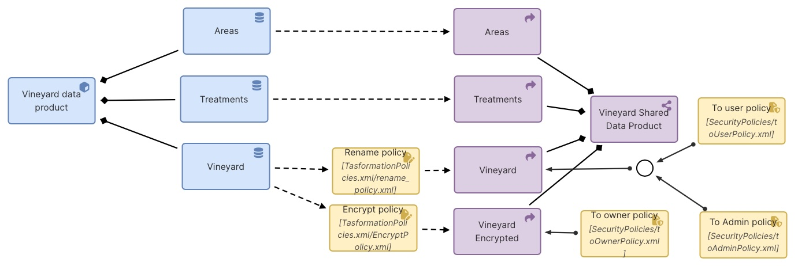
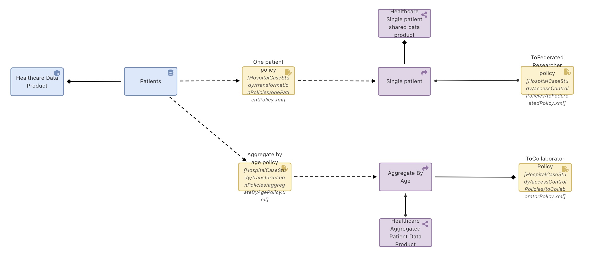
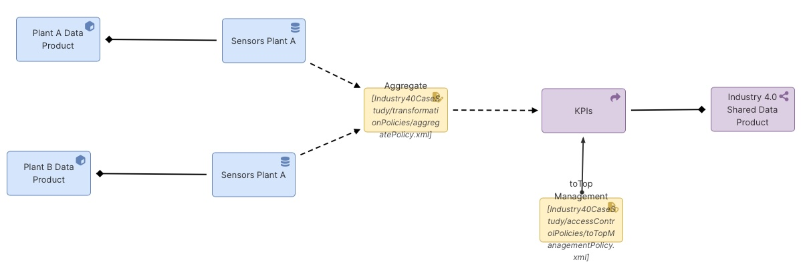
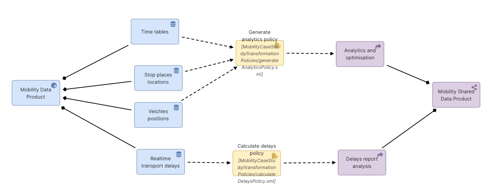

# Examples

DSPN has been validated in different domains: healthcare, industry 4.0, agriculture, and mobility. These domains are part of the [EU Common Data Spaces](https://digital-strategy.ec.europa.eu/en/policies/data-spaces) and provide relevant scenarios in which the need to improve the data sharing is fundamental.

The policy view diagrams of these case studies are reported below along with a short description of the data sharing agreement.

## Agriculture

A Vineyard data product represents the information collected from the sensors placed in the vineyards: Areas, which returns aggregated statistics by geographical area; Treatments, which returns the type of treatments provided to vineyards; and vineyard, which returns the data collected by the sensors.

## Healthcare

Patient data within a hospital may be used for administrative, clinical, or research purposes. This implies that different actors—both internal and external to the organization—may access such data with varying levels of visibility.

Specifically, we assume that an internal collaborator can access patient data only in anonymized form, aggregated by age. These data must be stored exclusively within the European Union and retained for no longer than six months.

With regard to an external collaborator, belonging to an organization with which the hospital has a federation agreement, full patient data may be accessible; however, bulk queries are not permitted. In fact, each request must explicitly specify the identifier of the patient being queried.

## Industry 4.0

A manufacturing company with multiple plants distributed across different locations needs to integrate data collected from sensors installed on machinery within these production facilities. Assuming that each plant provides a data product exposing its exportable data, a shared data product is then created to deliver the resulting KPI values to specific actors authorized to access and view them.

## Mobility

n this scenario, it is assumed that the data made available by a local public transport operator are public, but only in aggregated form. In such a case, data from multiple sources are integrated to provide a unified view, without the need for authorization policies, as the data are freely accessible.

[*]The [project folder](../projects/) contains the XML files that can be read by the dspn-editor. 
